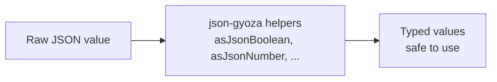

<!-- BEGIN BAOHAUS README HEADER -->
# @baohaus/json-gyoza

[](../../README.md)
[](https://bun.sh)
[](https://www.typescriptlang.org/)
[](./package.json)

## Explain Like I'm Five

This crate is the mailroom's tiny data tongs. It picks booleans, grabs numbers, and checks arrays out of JSON -- small but precise.

## Architecture



## Scope

| In scope | Dependencies | Out of scope |
| --- | --- | --- |
| Tiny JSON value helpers for Baohaus transport internals.; Exported API: asJsonArray, asJsonBoolean, asJsonNumber, asJsonObject, asJsonString, … | @baohaus/bao-json-safe; @baohaus/bao-utils | Other .bao crate domains; bao-runtime host lifecycle |
<!-- END BAOHAUS README HEADER -->

<!-- BEGIN BAOHAUS PACKAGE CARD -->
# @baohaus/json-gyoza

Tiny JSON value helpers for Baohaus transport internals.

Source at `bao-source/json-gyoza`.

## Public Pieces

`.`, `./jsonc`, `./package-descriptor`

## Proof Commands

Run from `bao-source/json-gyoza`:

- `bun run typecheck`
- `bun run test`
- `bun run lint`
<!-- END BAOHAUS PACKAGE CARD -->

<!-- BEGIN BAOHAUS PACKAGE MANUAL -->
## Quick start

From `bao-source/json-gyoza`:

```bash
bun install
bun run typecheck
bun run test
bun run build
bun run lint
bun run bao:build
bun run bao:validate
bun run verify
```

## Capability

Tiny JSON value helpers for Baohaus transport internals.

## Subpaths

| Subpath | Purpose |
| --- | --- |
| `.` | Main entry — typed surface from this .bao crate |
| `./package-descriptor` | Package descriptor — typed surface from this .bao crate |

## Primary symbols

- `asJsonArray`
- `asJsonBoolean`
- `asJsonNumber`
- `asJsonObject`
- `asJsonString`
- `isJsonValue`
- `JsonPrimitive`
- `JsonValue`
- `parseJsonValue`
- `renderJsonValue`

## Integration

Source: `bao-source/json-gyoza` (`src/index.ts`). Import published subpaths only; do not deep-link into `dist/`.

## Registry

Catalog id `json-gyoza` → OCI `baohaus/json-gyoza`.

## Reference

### Subpaths

| Subpath | Purpose |
| --- | --- |
| `.` | Main entry — typed surface from this .bao crate |
| `./package-descriptor` | Package descriptor — typed surface from this .bao crate |

### Symbols

- `asJsonArray`
- `asJsonBoolean`
- `asJsonNumber`
- `asJsonObject`
- `asJsonString`
- `isJsonValue`
- `JsonPrimitive`
- `JsonValue`
- `parseJsonValue`
- `renderJsonValue`
<!-- END BAOHAUS PACKAGE MANUAL -->
