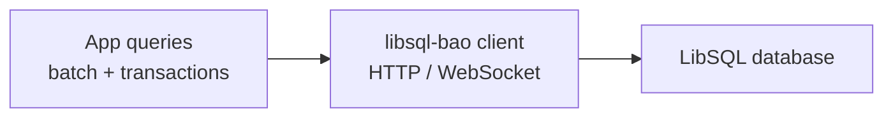

<!-- BEGIN BAOHAUS README HEADER -->
# @baohaus/libsql-bao

[](../../README.md)
[](https://bun.sh)
[](https://www.typescriptlang.org/)
[](./package.json)

## Explain Like I'm Five

This crate is the mailroom's filing cabinet. It reads and writes data to a LibSQL database -- the goose's permanent memory.

## Architecture



## Scope

| In scope | Dependencies | Out of scope |
| --- | --- | --- |
| LibSQL client parity: HTTP and WebSocket protocols, batch, transactions; Exported API: createClient, LibSQLClient, PACKAGE_NAME, UPSTREAM_PACKAGE | Shared @baohaus contracts | Other .bao crate domains; bao-runtime host lifecycle |
<!-- END BAOHAUS README HEADER -->

<!-- BEGIN BAOHAUS PACKAGE CARD -->
# @baohaus/libsql-bao

LibSQL client parity: HTTP and WebSocket protocols, batch, transactions

Source at `bao-source/libsql-bao`.

## Public Pieces

`.`, `./batch`, `./client`, `./sqlite`, `./transaction`, `./types`

## Proof Commands

Run from `bao-source/libsql-bao`:

- `bun run typecheck`
- `bun run test`
- `bun run lint`
<!-- END BAOHAUS PACKAGE CARD -->

<!-- BEGIN BAOHAUS PACKAGE MANUAL -->
## Quick start

From `bao-source/libsql-bao`:

```bash
bun install
bun run typecheck
bun run test
bun run build
bun run lint
bun run bao:build
bun run bao:validate
bun run verify
```

## Capability

LibSQL client parity: HTTP and WebSocket protocols, batch, transactions

## Subpaths

| Subpath | Purpose |
| --- | --- |
| `.` | Main entry — typed surface from this .bao crate |
| `./batch` | Batch — typed surface from this .bao crate |
| `./client` | Client — typed surface from this .bao crate |
| `./sqlite` | Sqlite — typed surface from this .bao crate |
| `./transaction` | Transaction — typed surface from this .bao crate |
| `./types` | Types — typed surface from this .bao crate |

## Primary symbols

- `createClient`
- `LibSQLClient`
- `PACKAGE_NAME`
- `UPSTREAM_PACKAGE`

## Integration

Source: `bao-source/libsql-bao` (`src/index.ts`). Import published subpaths only; do not deep-link into `dist/`.

## Registry

Catalog id `libsql-bao` → OCI `baohaus/libsql-bao`.

## Reference

### Subpaths

| Subpath | Purpose |
| --- | --- |
| `.` | Main entry — typed surface from this .bao crate |
| `./batch` | Batch — typed surface from this .bao crate |
| `./client` | Client — typed surface from this .bao crate |
| `./sqlite` | Sqlite — typed surface from this .bao crate |
| `./transaction` | Transaction — typed surface from this .bao crate |
| `./types` | Types — typed surface from this .bao crate |

### Symbols

- `createClient`
- `LibSQLClient`
- `PACKAGE_NAME`
- `UPSTREAM_PACKAGE`
<!-- END BAOHAUS PACKAGE MANUAL -->
