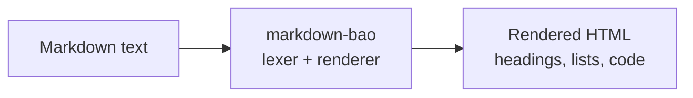

<!-- BEGIN BAOHAUS README HEADER -->
# @baohaus/markdown-bao

[](../../README.md)
[](https://bun.sh)
[](https://www.typescriptlang.org/)
[](./package.json)

## Explain Like I'm Five

This crate is the mailroom's formatting pen. Hand it plain text with special marks, and it draws headings, bold words, and lists -- turning notes into neat pages.

## Architecture



## Scope

| In scope | Dependencies | Out of scope |
| --- | --- | --- |
| Marked parity: GFM, tokenizer, renderer, extensions, lexer; Exported API: lexer, marked, PACKAGE_NAME, parse, parser, … | Shared @baohaus contracts | Other .bao crate domains; bao-runtime host lifecycle |
<!-- END BAOHAUS README HEADER -->

<!-- BEGIN BAOHAUS PACKAGE CARD -->
# @baohaus/markdown-bao

Marked parity: GFM, tokenizer, renderer, extensions, lexer

Source at `bao-source/markdown-bao`.

## Public Pieces

`.`, `./gfm`, `./lexer`, `./renderer`, `./tokenizer`

## Proof Commands

Run from `bao-source/markdown-bao`:

- `bun run typecheck`
- `bun run test`
- `bun run lint`
<!-- END BAOHAUS PACKAGE CARD -->

<!-- BEGIN BAOHAUS PACKAGE MANUAL -->
## Quick start

From `bao-source/markdown-bao`:

```bash
bun install
bun run typecheck
bun run test
bun run build
bun run lint
bun run bao:build
bun run bao:validate
bun run verify
```

## Capability

Marked parity: GFM, tokenizer, renderer, extensions, lexer

## Subpaths

| Subpath | Purpose |
| --- | --- |
| `.` | Main entry — typed surface from this .bao crate |
| `./gfm` | Gfm — typed surface from this .bao crate |
| `./lexer` | Lexer — typed surface from this .bao crate |
| `./renderer` | Renderer — typed surface from this .bao crate |
| `./tokenizer` | Tokenizer — typed surface from this .bao crate |

## Primary symbols

- `lexer`
- `marked`
- `PACKAGE_NAME`
- `parse`
- `parser`
- `renderHTML`
- `tokenize`

## Integration

Source: `bao-source/markdown-bao` (`src/index.ts`). Import published subpaths only; do not deep-link into `dist/`.

## Registry

Catalog id `markdown-bao` → OCI `baohaus/markdown-bao`.

## Reference

### Subpaths

| Subpath | Purpose |
| --- | --- |
| `.` | Main entry — typed surface from this .bao crate |
| `./gfm` | Gfm — typed surface from this .bao crate |
| `./lexer` | Lexer — typed surface from this .bao crate |
| `./renderer` | Renderer — typed surface from this .bao crate |
| `./tokenizer` | Tokenizer — typed surface from this .bao crate |

### Symbols

- `lexer`
- `marked`
- `PACKAGE_NAME`
- `parse`
- `parser`
- `renderHTML`
- `tokenize`
<!-- END BAOHAUS PACKAGE MANUAL -->
