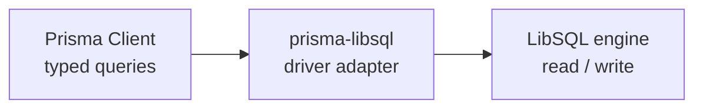

<!-- BEGIN BAOHAUS README HEADER -->
# @baohaus/prisma-libsql

[](../../README.md)
[](https://bun.sh)
[](https://www.typescriptlang.org/)
[](./package.json)

## Explain Like I'm Five

This crate is the mailroom's filing cabinet translator. It lets Prisma queries talk to LibSQL, so the database understands no matter how the question is asked.

## Architecture



## Scope

| In scope | Dependencies | Out of scope |
| --- | --- | --- |
| LibSQL database adapter for Prisma Client; Exported API: coerceParams, coercePrimitiveParam, ConnectionState, createConnection, createLibSQLAdapter, … | Shared @baohaus contracts | Other .bao crate domains; bao-runtime host lifecycle |
<!-- END BAOHAUS README HEADER -->

<!-- BEGIN BAOHAUS PACKAGE CARD -->
# @baohaus/prisma-libsql

LibSQL database adapter for Prisma Client

Source at `bao-source/prisma-libsql`.

## Public Pieces

`.`

## Proof Commands

Run from `bao-source/prisma-libsql`:

- `bun run typecheck`
- `bun run test`
- `bun run lint`
<!-- END BAOHAUS PACKAGE CARD -->

<!-- BEGIN BAOHAUS PACKAGE MANUAL -->
## Quick start

From `bao-source/prisma-libsql`:

```bash
bun install
bun run typecheck
bun run test
bun run build
bun run lint
bun run bao:build
bun run bao:validate
bun run verify
```

## Capability

LibSQL database adapter for Prisma Client

## Subpaths

| Subpath | Purpose |
| --- | --- |
| `.` | Main entry — typed surface from this .bao crate |

## Primary symbols

- `coerceParams`
- `coercePrimitiveParam`
- `ConnectionState`
- `createConnection`
- `createLibSQLAdapter`
- `createLibSQLDriverAdapter`
- `getLibSQLConfig`
- `InteractiveTransaction`
- `isLibSQLError`
- `LibSQLConnection`
- `LibSQLConnectionError`
- `LibSQLDriverAdapter`

## Integration

Source: `bao-source/prisma-libsql` (`src/index.ts`). Import published subpaths only; do not deep-link into `dist/`.

## Registry

Catalog id `prisma-libsql` → OCI `baohaus/prisma-libsql`.

## Reference

### Subpaths

| Subpath | Purpose |
| --- | --- |
| `.` | Main entry — typed surface from this .bao crate |

### Symbols

- `coerceParams`
- `coercePrimitiveParam`
- `ConnectionState`
- `createConnection`
- `createLibSQLAdapter`
- `createLibSQLDriverAdapter`
- `getLibSQLConfig`
- `InteractiveTransaction`
- `isLibSQLError`
- `LibSQLConnection`
- `LibSQLConnectionError`
- `LibSQLDriverAdapter`
<!-- END BAOHAUS PACKAGE MANUAL -->
