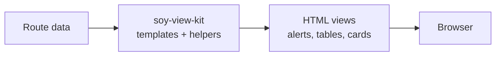

<!-- BEGIN BAOHAUS README HEADER -->
# @baohaus/soy-view-kit

[](../../README.md)
[](https://bun.sh)
[](https://www.typescriptlang.org/)
[](./package.json)

## Explain Like I'm Five

This crate is the mailroom's display tools. Server-side view helpers and HTMX response builders that help the goose arrange pages before they leave the mailroom.

## Architecture



## Scope

| In scope | Dependencies | Out of scope |
| --- | --- | --- |
| Server-rendered view helpers and HTMX response primitives for Baohaus. | @baohaus/har-gow-config | Other .bao crate domains; bao-runtime host lifecycle |
<!-- END BAOHAUS README HEADER -->

<!-- BEGIN BAOHAUS PACKAGE CARD -->
# @baohaus/soy-view-kit

Server-rendered view helpers and HTMX response primitives for Baohaus.

Source at `bao-source/soy-view-kit`.

## Public Pieces

`.`, `./audio`, `./html`, `./i18n`, `./i18n-types`, `./locales/en`, `./locales/ko`, `./templates/alert`, `./templates/breadcrumbs`, `./templates/buttons`, `./templates/confirm-dialog`, `./templates/data-table`, `./templates/definition-grid`, `./templates/design-tokens`, `./templates/empty-state`, `./templates/entity-header`, `./templates/error-boundary`, `./templates/filter-bar`, `./templates/form-group`, `./templates/htmx`, `./templates/icons`, `./templates/loading-indicator`, `./templates/metric-row`, `./templates/page-header`, `./templates/page-states`, `./templates/pagination`, `./templates/section-card`, `./templates/sidebar`, `./templates/skeleton`, `./templates/stat-card`, `./templates/status-badge`, `./templates/styles/templates.css`, `./templates/tab-strip`, `./templates/toast-container`, `./templates/types`

## Proof Commands

Run from `bao-source/soy-view-kit`:

- `bun run typecheck`
- `bun run test`
- `bun run lint`
<!-- END BAOHAUS PACKAGE CARD -->

<!-- BEGIN BAOHAUS PACKAGE MANUAL -->
## Quick start

From `bao-source/soy-view-kit`:

```bash
bun install
bun run typecheck
bun run test
bun run build
bun run lint
bun run bao:build
bun run bao:validate
bun run verify
```

## Capability

Server-rendered view helpers and HTMX response primitives for Baohaus.

## Subpaths

| Subpath | Purpose |
| --- | --- |
| `.` | Main entry — typed surface from this .bao crate |
| `./audio` | Audio — typed surface from this .bao crate |
| `./html` | Html — typed surface from this .bao crate |
| `./i18n` | I18n — typed surface from this .bao crate |
| `./i18n-types` | I18n types — typed surface from this .bao crate |
| `./locales/en` | Locales/en — typed surface from this .bao crate |
| `./locales/ko` | Locales/ko — typed surface from this .bao crate |
| `./templates/alert` | Templates/alert — typed surface from this .bao crate |
| `./templates/breadcrumbs` | Templates/breadcrumbs — typed surface from this .bao crate |
| `./templates/buttons` | Templates/buttons — typed surface from this .bao crate |
| `./templates/confirm-dialog` | Templates/confirm dialog — typed surface from this .bao crate |
| `./templates/data-table` | Templates/data table — typed surface from this .bao crate |
| _…_ | _22 more export(s) in package.json_ |

## Integration

Source: `bao-source/soy-view-kit`. Import published subpaths only; do not deep-link into `dist/`.

## Registry

Catalog id `soy-view-kit` → OCI `baohaus/soy-view-kit`.

## Reference

### Subpaths

| Subpath | Purpose |
| --- | --- |
| `.` | Main entry — typed surface from this .bao crate |
| `./audio` | Audio — typed surface from this .bao crate |
| `./html` | Html — typed surface from this .bao crate |
| `./i18n` | I18n — typed surface from this .bao crate |
| `./i18n-types` | I18n types — typed surface from this .bao crate |
| `./locales/en` | Locales/en — typed surface from this .bao crate |
| `./locales/ko` | Locales/ko — typed surface from this .bao crate |
| `./templates/alert` | Templates/alert — typed surface from this .bao crate |
| `./templates/breadcrumbs` | Templates/breadcrumbs — typed surface from this .bao crate |
| `./templates/buttons` | Templates/buttons — typed surface from this .bao crate |
| `./templates/confirm-dialog` | Templates/confirm dialog — typed surface from this .bao crate |
| `./templates/data-table` | Templates/data table — typed surface from this .bao crate |
| _…_ | _22 more in `package.json#exports`_ |
<!-- END BAOHAUS PACKAGE MANUAL -->
