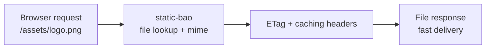

<!-- BEGIN BAOHAUS README HEADER -->
# @baohaus/static-bao

[](../../README.md)
[](https://bun.sh)
[](https://www.typescriptlang.org/)
[](./package.json)

## Explain Like I'm Five

This crate is the mailroom's package shelf. It hands out static files -- images, scripts, stylesheets -- with proper labels, caching tags, and fast delivery.

## Architecture



## Scope

| In scope | Dependencies | Out of scope |
| --- | --- | --- |
| Static file serving with etag, range, mime detection; Exported API: getMimeType, PACKAGE_NAME, resolveAssetPath, serveStatic, staticPlugin | Shared @baohaus contracts | Other .bao crate domains; bao-runtime host lifecycle |
<!-- END BAOHAUS README HEADER -->

<!-- BEGIN BAOHAUS PACKAGE CARD -->
# @baohaus/static-bao

Static file serving with etag, range, mime detection

Source at `bao-source/static-bao`.

## Public Pieces

`.`

## Proof Commands

Run from `bao-source/static-bao`:

- `bun run typecheck`
- `bun run test`
- `bun run lint`
<!-- END BAOHAUS PACKAGE CARD -->

<!-- BEGIN BAOHAUS PACKAGE MANUAL -->
## Quick start

From `bao-source/static-bao`:

```bash
bun install
bun run typecheck
bun run test
bun run build
bun run lint
bun run bao:build
bun run bao:validate
bun run verify
```

## Capability

Static file serving with etag, range, mime detection

## Subpaths

| Subpath | Purpose |
| --- | --- |
| `.` | Main entry — typed surface from this .bao crate |

## Primary symbols

- `getMimeType`
- `PACKAGE_NAME`
- `resolveAssetPath`
- `serveStatic`
- `staticPlugin`

## Integration

Source: `bao-source/static-bao` (`src/index.ts`). Import published subpaths only; do not deep-link into `dist/`.

## Registry

Catalog id `static-bao` → OCI `baohaus/static-bao`.

## Reference

### Subpaths

| Subpath | Purpose |
| --- | --- |
| `.` | Main entry — typed surface from this .bao crate |

### Symbols

- `getMimeType`
- `PACKAGE_NAME`
- `resolveAssetPath`
- `serveStatic`
- `staticPlugin`
<!-- END BAOHAUS PACKAGE MANUAL -->
