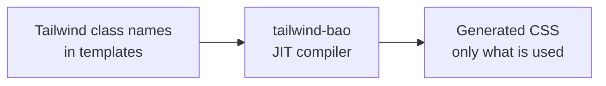

<!-- BEGIN BAOHAUS README HEADER -->
# @baohaus/tailwind-bao

[](../../README.md)
[](https://bun.sh)
[](https://www.typescriptlang.org/)
[](./package.json)

## Explain Like I'm Five

This crate is the mailroom's style compiler. It reads Tailwind class names and generates exactly the CSS needed -- no extra paint, no wasted ink.

## Architecture



## Scope

| In scope | Dependencies | Out of scope |
| --- | --- | --- |
| Tailwind CSS v4 engine parity: JIT compiler, utility generation, arbitrary values, variants; Exported API: CompiledUtility, createCompiler, PACKAGE_NAME, TailwindCompiler, TailwindConfig, … | Shared @baohaus contracts | Other .bao crate domains; bao-runtime host lifecycle |
<!-- END BAOHAUS README HEADER -->

<!-- BEGIN BAOHAUS PACKAGE CARD -->
# @baohaus/tailwind-bao

Tailwind CSS v4 engine parity: JIT compiler, utility generation, arbitrary values, variants

Source at `bao-source/tailwind-bao`.

## Public Pieces

`.`, `./compile`, `./config`, `./utilities`

## Proof Commands

Run from `bao-source/tailwind-bao`:

- `bun run typecheck`
- `bun run test`
- `bun run lint`
<!-- END BAOHAUS PACKAGE CARD -->

<!-- BEGIN BAOHAUS PACKAGE MANUAL -->
## Quick start

From `bao-source/tailwind-bao`:

```bash
bun install
bun run typecheck
bun run test
bun run build
bun run lint
bun run bao:build
bun run bao:validate
bun run verify
```

## Capability

Tailwind CSS v4 engine parity: JIT compiler, utility generation, arbitrary values, variants

## Subpaths

| Subpath | Purpose |
| --- | --- |
| `.` | Main entry — typed surface from this .bao crate |
| `./compile` | Compile — typed surface from this .bao crate |
| `./config` | Config — typed surface from this .bao crate |
| `./utilities` | Utilities — typed surface from this .bao crate |

## Primary symbols

- `CompiledUtility`
- `createCompiler`
- `PACKAGE_NAME`
- `TailwindCompiler`
- `TailwindConfig`
- `UPSTREAM_PACKAGE`

## Integration

Source: `bao-source/tailwind-bao` (`src/index.ts`). Import published subpaths only; do not deep-link into `dist/`.

## Registry

Catalog id `tailwind-bao` → OCI `baohaus/tailwind-bao`.

## Reference

### Subpaths

| Subpath | Purpose |
| --- | --- |
| `.` | Main entry — typed surface from this .bao crate |
| `./compile` | Compile — typed surface from this .bao crate |
| `./config` | Config — typed surface from this .bao crate |
| `./utilities` | Utilities — typed surface from this .bao crate |

### Symbols

- `CompiledUtility`
- `createCompiler`
- `PACKAGE_NAME`
- `TailwindCompiler`
- `TailwindConfig`
- `UPSTREAM_PACKAGE`
<!-- END BAOHAUS PACKAGE MANUAL -->
