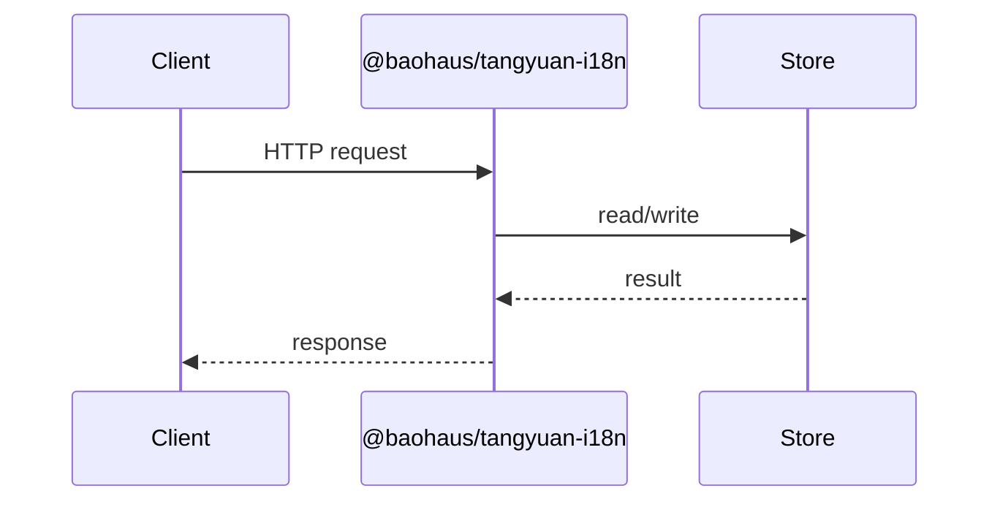

<!-- BEGIN BAOHAUS README HEADER -->
# @baohaus/tangyuan-i18n

## Explain Like I'm Five

Canonical SSR i18n primitive: ICU MessageFormat, Accept-Language negotiation, parity audit, and an Elysia plugin. Built on @baohaus/baobox. Import subpaths like `./accept-language`, `./bcp47`, `./catalog`, `./contracts` when you wire this crate in.

## Architecture



## Scope

| In scope | Dependencies | Out of scope |
| --- | --- | --- |
| Canonical SSR i18n primitive: ICU MessageFormat, Accept-Language negotiation, parity audit, and an Elysia plugin. | @baohaus/baobox | Other workbench domains; bao-runtime host lifecycle |
<!-- END BAOHAUS README HEADER -->

<!-- BEGIN BAOHAUS PACKAGE CARD -->
# @baohaus/tangyuan-i18n

Standalone Baohaus package. Catalog identity `tangyuan-i18n`. Source at `bao-source/tangyuan-i18n`. Publishes to `baohaus/tangyuan-i18n`. Canonical archive: `bao-source/tangyuan-i18n/dist/bao/tangyuan-i18n.bao`.

Cross-app contract and the full principles list live at the repo-root [README](../../README.md#principles).

## Package Facts

| Field | Value |
| --- | --- |
| Package | `@baohaus/tangyuan-i18n` |
| Catalog id | `tangyuan-i18n` |
| Source path | `bao-source/tangyuan-i18n` |
| OCI repository | `baohaus/tangyuan-i18n` |
| Channel | `public` |
| Visibility | `public` |
| Kind | `library` |
| Runtime installable | `yes` |
| Publish gate | `standard` |

## Public Pieces

`.`, `./accept-language`, `./bcp47`, `./catalog`, `./contracts`, `./detect`, `./elysia`, `./icu`, `./package-descriptor`, `./parity`, `./translator`.

## Proof Commands

Run from `bao-source/tangyuan-i18n`:

- `bun run build`
- `bun run typecheck`
- `bun run test`
- `bun run lint`
- `bun run bao:build`
- `bun run bao:validate`
- `bun run verify`

## Publishing Path

`@baohaus/tangyuan-i18n` publishes to `baohaus/tangyuan-i18n` through the canonical `.bao` registry distribution path. Local overrides are development-only; installable content resolves through the registry and the checked catalog/governance/lock path.
<!-- END BAOHAUS PACKAGE CARD -->

<!-- BEGIN BAOHAUS PACKAGE MANUAL -->
## Quick start

From `bao-source/tangyuan-i18n`:

```bash
bun install
bun run typecheck
bun run test
bun run build
bun run lint
bun run bao:build
bun run bao:validate
bun run verify
```

## Capability

Canonical SSR i18n primitive: ICU MessageFormat, Accept-Language negotiation, parity audit, and an Elysia plugin. Built on @baohaus/baobox.

## Subpaths

| Subpath | Purpose |
| --- | --- |
| `.` | Main entry — typed surface from this workbench |
| `./accept-language` | Accept language — typed surface from this workbench |
| `./bcp47` | Bcp47 — typed surface from this workbench |
| `./catalog` | Catalog — typed surface from this workbench |
| `./contracts` | Contracts — typed surface from this workbench |
| `./detect` | Detect — typed surface from this workbench |
| `./elysia` | Elysia — typed surface from this workbench |
| `./icu` | Icu — typed surface from this workbench |
| `./package-descriptor` | Package descriptor — typed surface from this workbench |
| `./parity` | Parity — typed surface from this workbench |
| `./translator` | Translator — typed surface from this workbench |

## Integration

Source: `bao-source/tangyuan-i18n`. Import published subpaths only; do not deep-link into `dist/`.

## Registry

Catalog id `tangyuan-i18n` → OCI `baohaus/tangyuan-i18n`.

## Reference

### Subpaths

| Subpath | Purpose |
| --- | --- |
| `.` | Main entry — typed surface from this workbench |
| `./accept-language` | Accept language — typed surface from this workbench |
| `./bcp47` | Bcp47 — typed surface from this workbench |
| `./catalog` | Catalog — typed surface from this workbench |
| `./contracts` | Contracts — typed surface from this workbench |
| `./detect` | Detect — typed surface from this workbench |
| `./elysia` | Elysia — typed surface from this workbench |
| `./icu` | Icu — typed surface from this workbench |
| `./package-descriptor` | Package descriptor — typed surface from this workbench |
| `./parity` | Parity — typed surface from this workbench |
| `./translator` | Translator — typed surface from this workbench |
<!-- END BAOHAUS PACKAGE MANUAL -->
