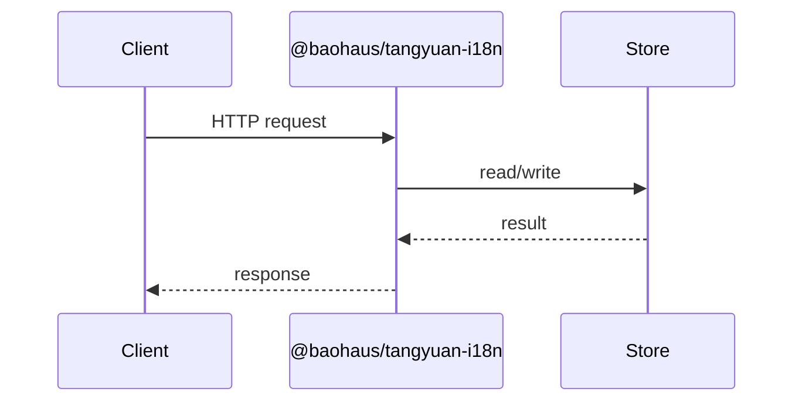

<!-- BEGIN BAOHAUS README HEADER -->
# @baohaus/tangyuan-i18n

[](../../README.md)
[](https://bun.sh)
[](https://www.typescriptlang.org/)
[](./package.json)

## Explain Like I'm Five

This crate is the mailroom's translator. It reads which language the visitor speaks, finds the right phrasebook, and stamps every page in that language -- no page reload needed.

## Architecture



## Scope

| In scope | Dependencies | Out of scope |
| --- | --- | --- |
| Canonical SSR i18n primitive: ICU MessageFormat, Accept-Language negotiation, parity audit, and an Elysia plugin. | @baohaus/baobox | Other .bao crate domains; bao-runtime host lifecycle |
<!-- END BAOHAUS README HEADER -->

<!-- BEGIN BAOHAUS PACKAGE CARD -->
# @baohaus/tangyuan-i18n

Canonical SSR i18n primitive: ICU MessageFormat, Accept-Language negotiation, parity audit, and an Elysia plugin. Built on @baohaus/baobox.

Source at `bao-source/tangyuan-i18n`.

## Public Pieces

`.`, `./accept-language`, `./bcp47`, `./catalog`, `./contracts`, `./detect`, `./elysia`, `./icu`, `./package-descriptor`, `./parity`, `./translator`

## Proof Commands

Run from `bao-source/tangyuan-i18n`:

- `bun run typecheck`
- `bun run test`
- `bun run lint`
<!-- END BAOHAUS PACKAGE CARD -->

<!-- BEGIN BAOHAUS PACKAGE MANUAL -->
## Quick start

From `bao-source/tangyuan-i18n`:

```bash
bun install
bun run typecheck
bun run test
bun run build
bun run lint
bun run bao:build
bun run bao:validate
bun run verify
```

## Capability

Canonical SSR i18n primitive: ICU MessageFormat, Accept-Language negotiation, parity audit, and an Elysia plugin. Built on @baohaus/baobox.

## Subpaths

| Subpath | Purpose |
| --- | --- |
| `.` | Main entry — typed surface from this .bao crate |
| `./accept-language` | Accept language — typed surface from this .bao crate |
| `./bcp47` | Bcp47 — typed surface from this .bao crate |
| `./catalog` | Catalog — typed surface from this .bao crate |
| `./contracts` | Contracts — typed surface from this .bao crate |
| `./detect` | Detect — typed surface from this .bao crate |
| `./elysia` | Elysia — typed surface from this .bao crate |
| `./icu` | Icu — typed surface from this .bao crate |
| `./package-descriptor` | Package descriptor — typed surface from this .bao crate |
| `./parity` | Parity — typed surface from this .bao crate |
| `./translator` | Translator — typed surface from this .bao crate |

## Integration

Source: `bao-source/tangyuan-i18n`. Import published subpaths only; do not deep-link into `dist/`.

## Registry

Catalog id `tangyuan-i18n` → OCI `baohaus/tangyuan-i18n`.

## Reference

### Subpaths

| Subpath | Purpose |
| --- | --- |
| `.` | Main entry — typed surface from this .bao crate |
| `./accept-language` | Accept language — typed surface from this .bao crate |
| `./bcp47` | Bcp47 — typed surface from this .bao crate |
| `./catalog` | Catalog — typed surface from this .bao crate |
| `./contracts` | Contracts — typed surface from this .bao crate |
| `./detect` | Detect — typed surface from this .bao crate |
| `./elysia` | Elysia — typed surface from this .bao crate |
| `./icu` | Icu — typed surface from this .bao crate |
| `./package-descriptor` | Package descriptor — typed surface from this .bao crate |
| `./parity` | Parity — typed surface from this .bao crate |
| `./translator` | Translator — typed surface from this .bao crate |
<!-- END BAOHAUS PACKAGE MANUAL -->
