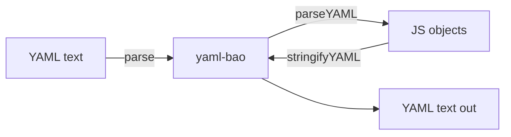

<!-- BEGIN BAOHAUS README HEADER -->
# @baohaus/yaml-bao

[](../../README.md)
[](https://bun.sh)
[](https://www.typescriptlang.org/)
[](./package.json)

## Explain Like I'm Five

This crate is the mailroom's YAML reader. It turns those indent-based config files into data the goose can use, and writes them back just as neatly.

## Architecture



## Scope

| In scope | Dependencies | Out of scope |
| --- | --- | --- |
| YAML parity: parse, stringify, custom types, anchors, merge keys; Exported API: PACKAGE_NAME, parseYAML, stringifyYAML | Shared @baohaus contracts | Other .bao crate domains; bao-runtime host lifecycle |
<!-- END BAOHAUS README HEADER -->

<!-- BEGIN BAOHAUS PACKAGE CARD -->
# @baohaus/yaml-bao

YAML parity: parse, stringify, custom types, anchors, merge keys

Source at `bao-source/yaml-bao`.

## Public Pieces

`.`, `./parse`, `./stringify`, `./types`

## Proof Commands

Run from `bao-source/yaml-bao`:

- `bun run typecheck`
- `bun run test`
- `bun run lint`
<!-- END BAOHAUS PACKAGE CARD -->

<!-- BEGIN BAOHAUS PACKAGE MANUAL -->
## Quick start

From `bao-source/yaml-bao`:

```bash
bun install
bun run typecheck
bun run test
bun run build
bun run lint
bun run bao:build
bun run bao:validate
bun run verify
```

## Capability

YAML parity: parse, stringify, custom types, anchors, merge keys

## Subpaths

| Subpath | Purpose |
| --- | --- |
| `.` | Main entry — typed surface from this .bao crate |
| `./parse` | Parse — typed surface from this .bao crate |
| `./stringify` | Stringify — typed surface from this .bao crate |
| `./types` | Types — typed surface from this .bao crate |

## Primary symbols

- `PACKAGE_NAME`
- `parseYAML`
- `stringifyYAML`

## Integration

Source: `bao-source/yaml-bao` (`src/index.ts`). Import published subpaths only; do not deep-link into `dist/`.

## Registry

Catalog id `yaml-bao` → OCI `baohaus/yaml-bao`.

## Reference

### Subpaths

| Subpath | Purpose |
| --- | --- |
| `.` | Main entry — typed surface from this .bao crate |
| `./parse` | Parse — typed surface from this .bao crate |
| `./stringify` | Stringify — typed surface from this .bao crate |
| `./types` | Types — typed surface from this .bao crate |

### Symbols

- `PACKAGE_NAME`
- `parseYAML`
- `stringifyYAML`
<!-- END BAOHAUS PACKAGE MANUAL -->
