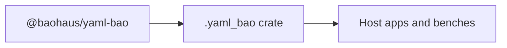

<!-- BEGIN BAOHAUS README HEADER -->
# @baohaus/yaml-bao

## Explain Like I'm Five

YAML parity: parse, stringify, custom types, anchors, merge keys. Apps use exports such as `PACKAGE_NAME`, `parseYAML`, `stringifyYAML` from `@baohaus/yaml-bao`.

## Architecture



## Scope

| In scope | Dependencies | Out of scope |
| --- | --- | --- |
| YAML parity: parse, stringify, custom types, anchors, merge keys; Exported API: PACKAGE_NAME, parseYAML, stringifyYAML | bao-governance.json; bao.lock; catalog row | Other workbench domains; bao-runtime host lifecycle |
<!-- END BAOHAUS README HEADER -->

<!-- BEGIN BAOHAUS PACKAGE CARD -->
# @baohaus/yaml-bao

Standalone Baohaus package. Catalog identity `yaml-bao`. Source at `bao-source/yaml-bao`. Publishes to `baohaus/yaml-bao`. Canonical archive: `bao-source/yaml-bao/dist/bao/yaml-bao.bao`.

Cross-app contract and the full principles list live at the repo-root [README](../../README.md#principles).

## Package Facts

| Field | Value |
| --- | --- |
| Package | `@baohaus/yaml-bao` |
| Catalog id | `yaml-bao` |
| Source path | `bao-source/yaml-bao` |
| OCI repository | `baohaus/yaml-bao` |
| Channel | `public` |
| Visibility | `public` |
| Kind | `library` |
| Runtime installable | `yes` |
| Publish gate | `standard` |

## Public Pieces

`.`, `./parse`, `./stringify`, `./types`.

## Proof Commands

Run from `bao-source/yaml-bao`:

- `bun run build`
- `bun run typecheck`
- `bun run test`
- `bun run lint`
- `bun run bao:build`
- `bun run bao:validate`
- `bun run verify`

## Publishing Path

`@baohaus/yaml-bao` publishes to `baohaus/yaml-bao` through the canonical `.bao` registry distribution path. Local overrides are development-only; installable content resolves through the registry and the checked catalog/governance/lock path.
<!-- END BAOHAUS PACKAGE CARD -->

<!-- BEGIN BAOHAUS PACKAGE MANUAL -->
## Quick start

From `bao-source/yaml-bao`:

```bash
bun install
bun run typecheck
bun run test
bun run build
bun run lint
bun run bao:build
bun run bao:validate
bun run verify
```

## Capability

YAML parity: parse, stringify, custom types, anchors, merge keys

## Subpaths

| Subpath | Purpose |
| --- | --- |
| `.` | Main entry — typed surface from this workbench |
| `./parse` | Parse — typed surface from this workbench |
| `./stringify` | Stringify — typed surface from this workbench |
| `./types` | Types — typed surface from this workbench |

## Primary symbols

- `PACKAGE_NAME`
- `parseYAML`
- `stringifyYAML`

## Integration

Source: `bao-source/yaml-bao` (`src/index.ts`). Import published subpaths only; do not deep-link into `dist/`.

## Registry

Catalog id `yaml-bao` → OCI `baohaus/yaml-bao`.

## Reference

### Subpaths

| Subpath | Purpose |
| --- | --- |
| `.` | Main entry — typed surface from this workbench |
| `./parse` | Parse — typed surface from this workbench |
| `./stringify` | Stringify — typed surface from this workbench |
| `./types` | Types — typed surface from this workbench |

### Symbols

- `PACKAGE_NAME`
- `parseYAML`
- `stringifyYAML`
<!-- END BAOHAUS PACKAGE MANUAL -->
