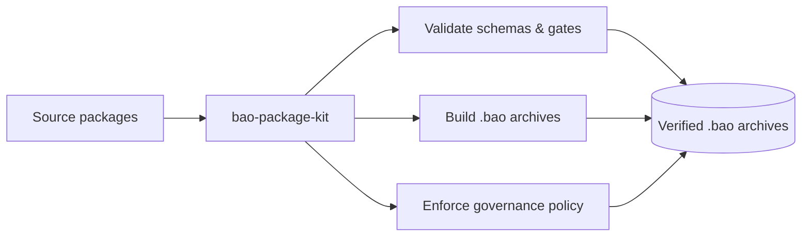

<!-- BEGIN BAOHAUS README HEADER -->
# @baohaus/bao-package-kit

[](../../README.md)
[](https://bun.sh)
[](https://www.typescriptlang.org/)
[](./package.json)

## Explain Like I'm Five

This crate is the mailroom's quality inspector. It checks that every crate is built right, labeled correctly, and follows the rules before it goes on the shelf.

## Architecture



## Scope

| In scope | Dependencies | Out of scope |
| --- | --- | --- |
| Spec, build, validate, and policy authority for Baohaus bao-governance. | @baohaus/bao-contracts; @baohaus/bao-schemas; @baohaus/bao-utils | Other .bao crate domains; bao-runtime host lifecycle |
<!-- END BAOHAUS README HEADER -->

<!-- BEGIN BAOHAUS PACKAGE CARD -->
# @baohaus/bao-package-kit

Spec, build, validate, and policy authority for Baohaus bao-governance.json, bao.lock, and .bao archives.

Source at `bao`.

## Public Pieces

`./catalog`, `./constants`, `./fs`, `./gates/boundaries`, `./gates/catalog-schema`, `./gates/ci-oci-path`, `./gates/deep-imports`, `./gates/import-scanner`, `./gates/manifest-parity`, `./gates/no-checkedin-bao`, `./gates/package-repos-parity`, `./gates/per-package-verify`, `./gates/registry-consumption`, `./gates/runtime-consumption`, `./gates/validators/allowlists`, `./gates/validators/context`, `./gates/validators/helpers`, `./gates/validators/patterns`, `./gates/validators/rules`, `./gates/validators/rules/accessibility-landmarks`, `./gates/validators/rules/bao-archive-policy`, `./gates/validators/rules/form-label-controls`, `./gates/validators/rules/htmx-form-contracts`, `./gates/validators/rules/htmx-swap-completeness`, `./gates/validators/rules/i18n-key-usage`, `./gates/validators/rules/i18n-parity`, `./gates/validators/rules/monolith-body-scan`, `./gates/validators/rules/monolith-char`, `./gates/validators/rules/monolith-skip-literals`, `./gates/validators/rules/no-arbitrary-spacing`, `./gates/validators/rules/no-banned-colors`, `./gates/validators/rules/no-bare-try-catch`, `./gates/validators/rules/no-client-fetch-drift`, `./gates/validators/rules/no-console`, `./gates/validators/rules/no-dead-exports`, `./gates/validators/rules/no-debug-markers`, `./gates/validators/rules/no-direct-env-access`, `./gates/validators/rules/no-direct-route-literals`, `./gates/validators/rules/no-fallback-shims`, `./gates/validators/rules/no-hardcoded-user-strings`, `./gates/validators/rules/no-local-styles`, `./gates/validators/rules/no-monoliths`, `./gates/validators/rules/no-node-imports`, `./gates/validators/rules/no-raw-design-tokens`, `./gates/validators/rules/no-retired-patterns`, `./gates/validators/rules/no-schema-duplication`, `./gates/validators/rules/no-ts-ignore`, `./gates/validators/rules/no-unknown-casts`, `./gates/validators/rules/no-unsafe-storage`, `./gates/validators/rules/page-state-contracts`, `./gates/validators/rules/seo-contracts`, `./logger`, `./manifest`, `./package-json`, `./readme`, `./readme-context`, `./readme-contract`, `./readme-merge`, `./readme-overrides`, `./scripts/lib/build-bao-archive`, `./scripts/lib/local-archive-parity`, `./scripts/lib/schema-guards`, `./tsconfig`

## Proof Commands

Run from `bao`:

- `bun run typecheck`
- `bun run test`
- `bun run lint`
<!-- END BAOHAUS PACKAGE CARD -->

<!-- BEGIN BAOHAUS PACKAGE MANUAL -->
## Quick start

From `bao`:

```bash
bun install
bun run typecheck
bun test
bun run build
bun run test
bun run lint
bun run bao:build
bun run bao:validate
bun run verify
```

## Capability

Spec, build, validate, and policy authority for Baohaus bao-governance.json, bao.lock, and .bao archives.

## Subpaths

| Subpath | Purpose |
| --- | --- |
| `./catalog` | Catalog — typed surface from this .bao crate |
| `./constants` | Constants — typed surface from this .bao crate |
| `./fs` | Fs — typed surface from this .bao crate |
| `./gates/boundaries` | Gates/boundaries — typed surface from this .bao crate |
| `./gates/catalog-schema` | Gates/catalog schema — shared schemas |
| `./gates/ci-oci-path` | Gates/ci oci path — typed surface from this .bao crate |
| `./gates/deep-imports` | Gates/deep imports — typed surface from this .bao crate |
| `./gates/import-scanner` | Gates/import scanner — typed surface from this .bao crate |
| `./gates/manifest-parity` | Gates/manifest parity — typed surface from this .bao crate |
| `./gates/no-checkedin-bao` | Gates/no checkedin bao — typed surface from this .bao crate |
| `./gates/package-repos-parity` | Gates/package repos parity — typed surface from this .bao crate |
| `./gates/per-package-verify` | Gates/per package verify — typed surface from this .bao crate |
| _…_ | _47 more export(s) in package.json_ |

## Integration

Source: `bao`. Import published subpaths only; do not deep-link into `dist/`.

## Registry

Catalog id `bao-package-kit` → OCI `baohaus/bao-package-kit`.

## Reference

### Subpaths

| Subpath | Purpose |
| --- | --- |
| `./catalog` | Catalog — typed surface from this .bao crate |
| `./constants` | Constants — typed surface from this .bao crate |
| `./fs` | Fs — typed surface from this .bao crate |
| `./gates/boundaries` | Gates/boundaries — typed surface from this .bao crate |
| `./gates/catalog-schema` | Gates/catalog schema — shared schemas |
| `./gates/ci-oci-path` | Gates/ci oci path — typed surface from this .bao crate |
| `./gates/deep-imports` | Gates/deep imports — port contracts for adapters |
| `./gates/import-scanner` | Gates/import scanner — port contracts for adapters |
| `./gates/manifest-parity` | Gates/manifest parity — typed surface from this .bao crate |
| `./gates/no-checkedin-bao` | Gates/no checkedin bao — typed surface from this .bao crate |
| `./gates/package-repos-parity` | Gates/package repos parity — typed surface from this .bao crate |
| `./gates/per-package-verify` | Gates/per package verify — typed surface from this .bao crate |
| _…_ | _47 more in `package.json#exports`_ |
<!-- END BAOHAUS PACKAGE MANUAL -->
