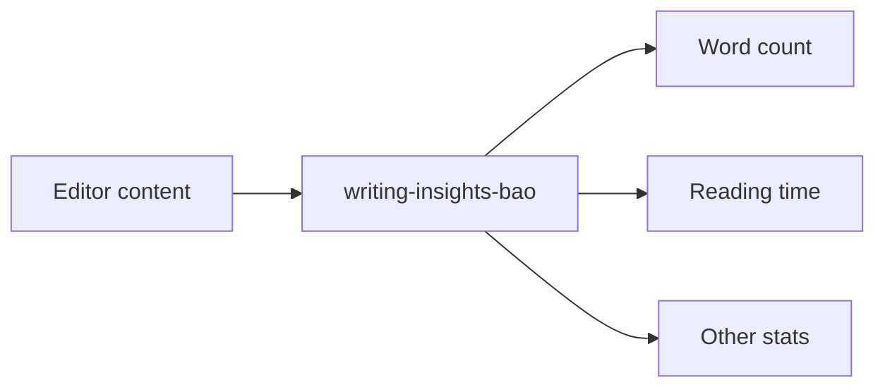

<!-- BEGIN BAOHAUS README HEADER -->
# @baohaus/writing-insights-bao

[](../../README.md)
[](https://bun.sh)
[](https://www.typescriptlang.org/)
[](./package.json)

## Explain Like I'm Five

This crate is the mailroom's word counter. It watches as you write and tells you how many words, how long to read, and other helpful numbers.

## Architecture



## Scope

| In scope | Dependencies | Out of scope |
| --- | --- | --- |
| Subpaths: . | Shared @baohaus contracts | Other .bao crate domains; bao-runtime host lifecycle |
<!-- END BAOHAUS README HEADER -->

<!-- BEGIN BAOHAUS PACKAGE CARD -->
# @baohaus/writing-insights-bao

Standalone package in the Baohaus monorepo.

Source at `goose-word-plugins/writing-insights-bao`.

## Public Pieces

`.`

## Proof Commands

Run from `goose-word-plugins/writing-insights-bao`:

- `bun run typecheck`
- `bun run test`
- `bun run lint`
<!-- END BAOHAUS PACKAGE CARD -->

<!-- BEGIN BAOHAUS PACKAGE MANUAL -->
## Quick start

From `goose-word-plugins/writing-insights-bao`:

```bash
bun install
bun run typecheck
bun run test
bun run lint
bun run build
bun run bao:build
bun run bao:validate
bun run verify
```

## Reference

### Subpaths

| Subpath | Purpose |
| --- | --- |
| `.` | Main entry — typed surface from this .bao crate |

## Integration

Source tree: `goose-word-plugins/writing-insights-bao` — entry `src/index.ts`.
Import only documented subpaths from the package card; do not deep-link into `dist/`.
<!-- END BAOHAUS PACKAGE MANUAL -->
