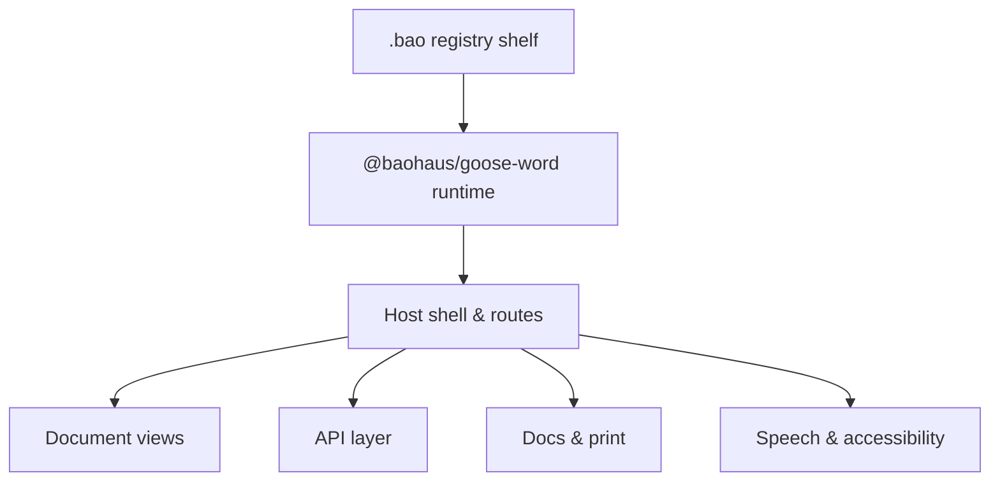

<!-- BEGIN BAOHAUS README HEADER -->
# @baohaus/goose-word

[](../../README.md)
[](https://bun.sh)
[](https://www.typescriptlang.org/)
[](./package.json)

## Explain Like I'm Five

This crate is the mailroom's main desk. People sit here to write, read, print, and speak their documents — it's where all the work happens, and every other crate delivers here.

## Architecture



## Scope

| In scope | Dependencies | Out of scope |
| --- | --- | --- |
| Subpaths: . | @baohaus/bao-install-handlers-bao; @baohaus/bao-json-safe; @baohaus/bao-sdk; @baohaus/baohaus-density-preset-aurora-bao; @baohaus/baohaus-design-tokens-aurora-bao; @baohaus/baohaus-theme-aurora-light-bao | Per-app business databases; OCI publish pipeline |
<!-- END BAOHAUS README HEADER -->

<!-- BEGIN BAOHAUS PACKAGE CARD -->
# @baohaus/goose-word

Standalone Baohaus package. Catalog identity `goose-word`. Source at `goose-word`. Publishes to `baohaus/goose-word`. Canonical archive: `goose-word/dist/goose-word.bao`.

Cross-app contract and the full principles list live at the repo-root [README](../../README.md#principles).

## Package Facts

| Field | Value |
| --- | --- |
| Package | `@baohaus/goose-word` |
| Catalog id | `goose-word` |
| Source path | `goose-word` |
| OCI repository | `baohaus/goose-word` |
| Channel | `internal` |
| Visibility | `hidden` |
| Kind | `runtime-package` |
| Runtime installable | `yes` |
| Publish gate | `strict` |

## Public Pieces

`.`.

## Proof Commands

Run from `goose-word`:

- `bun run bao:build`
- `bun run typecheck`
- `bun test`
- `bun run lint`
- `bun run bao:validate`
- `bun run verify`

## Publishing Path

`@baohaus/goose-word` publishes to `baohaus/goose-word` through the canonical `.bao` registry distribution path. Local overrides are development-only; installable content resolves through the registry and the checked catalog/governance/lock path.
<!-- END BAOHAUS PACKAGE CARD -->

<!-- BEGIN BAOHAUS PACKAGE MANUAL -->
## Quick start

From `goose-word`:

```bash
bun install
bun run typecheck
bun test
bun run bao:build
bun run test
bun run lint
bun run build
bun run bao:validate
bun run verify
```

## Reference

### Subpaths

| Subpath | Purpose |
| --- | --- |
| `.` | Main entry — typed surface from this .bao crate |

## Integration

Source tree: `goose-word`.
Import only documented subpaths from the package card; do not deep-link into `dist/`.

## Registry

Catalog id `goose-word` → OCI `baohaus/goose-word`.
Canonical archive path is listed in the package card above.
<!-- END BAOHAUS PACKAGE MANUAL -->
